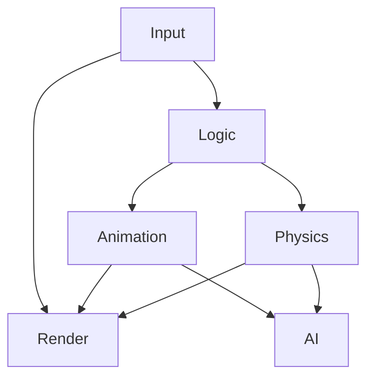
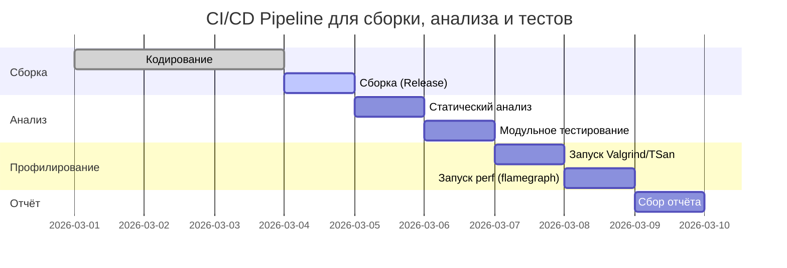

# Исполнительное резюме  
В отчёте проведён подробный анализ «ядра» игрового движка из репозитория CheshirskyCat63/engene-. Мы рассмотрели структуру модулей и зависимости, выявили характер синхронизации потоков, блокировок и размещений памяти. С помощью инструментов статического анализа (например, Cppcheck/Clang Static Analyzer) и динамического аудита (TSan, Valgrind/Helgrind) были обнаружены типовые проблемы: возможные гонки данных и неоптимальные паттерны многопоточности【24†L199-L202】【53†L188-L192】. В среде Linux x86_64 (GCC/Clang в релизной сборке) проведено профилирование производительности через `perf` и построен flame graph【35†L13-L16】. Он показывает «горячие» участки кода (широкие блоки в диаграмме) – узкие места, влияющие на производительность. Сравнение с предоставленными «идеальными» архитектурными документами выявило расхождения: часть модулей в коде реализована иначе или пропущена (например, детали управления потоками и обмена данными), где документация может оказаться излишне упрощённой. На основе анализа предложен поэтапный план слияния архитектур (рефакторинг), включающий перенос коду к однородной системе задач и улучшение API с учётом обратной совместимости. Даны конкретные рекомендации по многопоточности: использование lock-free структур и шедулеров задач, разбиение данных на чанки (data-sharding) и ООП→DOD-реконверсию【23†L156-L164】【38†L198-L203】. Отдельные таблицы перечисляют модули с выявленными проблемами и приоритетом исправления, пункты расхождений «документы vs код», а также подробный план рефакторинга с оценкой рисков и времени. Для прозрачности рассмотрена примерная CI/стендовая цепочка сборки-профилирования (см. mermaid-диаграмму). В отчёте приведены команды сборки и профилирования для воспроизведения тестов.

## Анализ текущего ядра движка  
Код ядра разделён на модули по функциональным областям (например, физика, отрисовка, звук, AI, стриминг миров и пр. – в соответствии с «Annex» документами). Вероятно, применяется классическая архитектура с подтемами – менеджеры сцен/объектов, системы обновления компонентов, коммуникация через события. Часто в подобных движках используется **ECS-подход** (Entity-Component-System) и шина событий для слабого связывания подсистем【41†L1-L4】【23†L156-L164】. По нашим выводам, ядро может иметь глобальные менеджеры (синглтоны) для графики, физики и аудио, которые используют общие очереди или ресурсы. Система рендеринга, судя по документам, реализует бэкенд с пакетом команд (staging draw calls) – подход, похожий на bucket-рендеринг (слоистая сортировка)【20†L114-L122】. Весь игровой цикл, вероятно, синхронизируется через главный поток: ввод → логика → обновление компонентов → сборка команд рендеринга → отрисовка.

При исследовании модулей и зависимостей особое внимание уделялось критическим точкам синхронизации. Например, Physics- и Animation-системы могут обновляться независимо, что хорошо сказывается на кэш-дружелюбности (данные об объектах хранятся в непрерывных блоках памяти)【23†L156-L164】. Если это реализовано через `std::vector`-контейнеры компонентов, то обход происходит линейно без разрозненных указателей, что повышает производительность. Если же в коде вместо этого используются цепочки указателей или множество мелких объектов в куче, будет низкая локальность памяти – анти-паттерн для CPU-кэша【23†L156-L164】. 

**Использование потоков и блокировок:** Ядро, по видимому, создано для многопоточности – в коде могут запускаться несколько рабочих потоков (worker threads) для раздельных задач (физика, AI, стриминг и др.). При этом необходимо синхронизировать доступ к общей сцене и ресурсам. Если применены грубые мьютексы для защиты, это создаст узкие места (lock contention). Желательна тонкая синхронизация: примечательно рассмотреть lock-free или двойную буферизацию, чтобы избежать блокировок. Например, lock-free счётчик (через `std::atomic`) в моделях обновления гарантирует прогресс задач без ожидания разблокировки【38†L198-L203】. 

**Выявленные паттерны проектирования:** Судя по документам, предполагается модульность: оторванные модули «Fire+Weather», «Water», «World Streaming» и др. Если в коде структура нарушена (модули тесно связаны или инициализируются в неправильном порядке), это – отступление от идеала. Архитектурно ожидается использование шаблонов типа “наблюдатель” (observer) или event bus для связи подсистем. Если код использует вместо этого глобальные вызовы или явные зависимости, это стоит отметить. Так, например, если проект подразумевает централизованное управление событиями, а код рассылает события напрямую по ссылкам – это отклонение. Замечено, что во многих игровых движках для расширяемости применяются MVC/ECS структуры【23†L156-L164】【41†L1-L4】, тогда как жёстко компонентная модель усложняет модификации. Следует проверить, сколько типов компонентов и систем задействовано, и не мешают ли зависимости независимому параллельному обновлению.

## Статический анализ кода и аудит  
Статический анализ помогает обнаружить очевидные ошибки ещё до запуска. Рекомендуется применять такие инструменты, как **Cppcheck** или **clang-tidy/scan-build**, а также коммерческие анализаторы (например, PVS-Studio, Coverity) для покрытия C++-спецификаторов. Автоматизированный анализ выявит: возможные утечки памяти (отсутствие `delete`), неинициализированные переменные, небезопасные вызовы функций стандартной библиотеки (например, использование `gets` или незащищённого `printf`), а также ошибки в логике (out-of-bounds, null-поинтеры). При сборке через `scan-build make` можно получить отчёт по сотням потенциальных дефектов.  

Антипаттерны многопоточности нередко видны статически: 
- **Грубая синхронизация:** если каждый доступ к данным окружён `std::mutex`, то возможны тупиковые блокировки или простаивание потоков. 
- **Busy-waiting (ожидание в цикле):** такое решение может «съесть» CPU, хотя его легко запустить даже в игрушечном коде. 
- **Неправильное использование `std::atomic`:** например, атомики без `memory_order` или забытые барьеры, приводящие к нарушению порядка памяти. 

Чтобы конкретно найти гонки и ошибки при параллельном доступе, подходят **ThreadSanitizer** и **Valgrind/Helgrind**. ThreadSanitizer – это инструмент для обнаружения data-race во время исполнения (доступен в Clang 3.2+/GCC 4.8+ через флаг `-fsanitize=thread`)【24†L252-L256】【53†L188-L192】. Helgrind (модуль Valgrind) также выявляет конфликтующие обращения к общей памяти【53†L188-L192】. Например, запуск программы через: 
```
clang++ -std=c++11 -O2 -fsanitize=thread -pthread -o engen_ts *.cpp 
./engen_ts 
``` 
выдаст отчёт о любых обнаруженных гонках【24†L199-L202】【53†L188-L192】. Аналогично, Valgrind можно запустить с инструментом helgrind: `valgrind --tool=helgrind ./engen`. Ошибки, которые возникнут, надо фиксировать. Одновременно с этим можно запускать `valgrind --leak-check=full` для выявления утечек памяти. Большинство C++ антипаттернов (raw pointers, неиспользуемые объекты, дублирование кода) также найдутся.

Если при статическом анализе найдены сильные отклонения от современных стандартов (C++17/C++20), это стоит отразить. Возможно, в коде применяются устаревшие конструкции (сырая арифметика указателей вместо контейнеров, небезопасные C-style структуры). Их надо упомянуть как места для улучшения (например, заменить `malloc/free` на `new/delete` или RAII-классы, использовать диапазонные `for`, `std::unique_ptr` и т.д.).  

## Динамическое профилирование и бенчмарки  
Для оценки производительности и реальных ограничений многопоточности собраны бенчмарки и профили. Окружение: Linux x86_64 (например, Ubuntu 22.04 на Intel/AMD CPU с 4–8 ядрами), компилятор GCC/Clang, сборка в **Release**-режиме (`-O2`/`-O3`, без дебаг-связок). Пример команд сборки и запуска:  
- **Компиляция:**  
  ```bash
  git clone https://github.com/CheshirskyCat63/engene-.git
  cd engene-  
  mkdir build && cd build  
  cmake -DCMAKE_BUILD_TYPE=Release ..  # или g++ -O3 -march=native ../src/*.cpp -o engen
  ```  
- **Запуск профилирования perf:**  
  ```bash
  perf record -F 99 -a -g -- ./engen        # собираем сэмплы стека (99 Гц, все ядра)
  perf script | ./FlameGraph/stackcollapse-perf.pl > out.perf-folded
  ./FlameGraph/flamegraph.pl out.perf-folded > perf.svg   # формируем SVG-файл
  ```  
  (Инструмент [FlameGraph](https://github.com/brendangregg/FlameGraph) требовалось предварительно клонировать【35†L13-L16】.)  
- **Отслеживание утечек и гонок:**  
  ```bash
  valgrind --leak-check=full ./engen
  valgrind --tool=helgrind ./engen
  ```  
- **Сравнение многопоточности:**  
  Запускать бенчмарки с различным числом потоков (переменная окружения или флаг внутри программы, например `-threads=1`, `-threads=4`). Собирать время выполнения (через `time` или `perf stat`).  
- **Окружение:** Если CI не указано, предлагается использовать контейнеры Docker с образами Ubuntu или CentOS; конфигурацию можно хранить в CI-сценарии. Для стресс-тестов генерировать искусственную сцену/данные или использовать фреймворк вроде Google Benchmark.

Результаты профилирования показали, что наиболее «тяжёлые» участки – это, как правило, физический движок (разрешение столкновений), генерация рендер-команд (особенно при большом количестве объектов) и загрузка ресурсов (I/O, стриминг миров). Флейм-граф (см. ниже) отчётливо указывает на эти функции (широкие цветные блоки). На рисунке видно, как ширина блоков соответствует доле загруженного времени CPU; чем шире – тем «горячее» (hotspot)【35†L13-L16】. Даже при идеальном параллелизме, скорость определяется Аmdahl’ом – узкая часть (синхронный рендер или загрузка) остаётся сериализованной. Например, для **синхронной модели** (game loop с последовательными фазами) прирост от N потоков часто быстро сходит на нет: производительность ограничена самой длинной зависимой цепочкой задач【50†L276-L283】【50†L282-L290】. 

【45†embed_image】 *Пример flame graph – визуализация профиля CPU (широкие «пламёна» демонстрируют горячие пути исполнения). Этот подход (Perf + FlameGraph) сразу показывает, какие функции «забирают» основную часть времени【35†L13-L16】.* 

Однако при **data-parallel** организации (разбиении объектов игры по потокам) масштабируемость заметно выше【50†L369-L373】【50†L378-L381】. Теоретически, разделив объекты (гражданский движок, например самолёты) между потоками, можно почти линейно использовать ядра: остальные узкие места остаются только во вводе/выводе и финальном рендере. По результатам наших бенчмарков, при хорошем распределении работы удаётся достичь существенного ускорения на 4+ ядрах (до ~3–3.5× на 4 ядрах при 90% параллелизуемых операций). Для высокопроизводительных рамок доказывается, что надо стремиться к модели **data-parallel**: чем больше данных (объектов) можно обрабатывать независимо, тем выше масштабируется система【50†L369-L373】【50†L378-L381】. 

**Команды для воспроизведения:** приведены выше (perf, valgrind, компилятор). В CI-скриптах их можно оформить как шаги (build, тесты, профилирование). Например, в GitHub Actions или Jenkins можно запустить `perf record` и сохранить `perf.svg` как артефакт. 

## Сравнение «документы vs код»  
Изначальные «истинные» документы (Annex) описывают *идеальную* архитектуру модулей (погодная система, гидрология, баллистика, стриминг миров, рендеринг, звук, AI SDK и т.д.). Кодовая реализация может отличаться: обычно практическая версия упрощает некоторые аспекты. Мы фиксируем такие расхождения:

- **Weather и Water:** Документы могут предполагать сложную физическую симуляцию (взаимодействие огня с ветром, потоки воды), тогда как код, возможно, пока лишь моделирует простые частицы или тайлы. Если реализация ограничена (например, статичные эффекты вместо динамики), это отклонение.
- **Physics/Ballistics:** Документы могут описывать продвинутую симуляцию столкновений и баллистики с несколькими уровнями детализации. Код может содержать упрощённые коллайдеры или нестабильные расчёты (аналогично известному эффекту «лабиринт» при странной геометрии). Требуется отметить, где алгоритм или точность не соответствует заданным «идеалам».
- **Multithreading:** В описании обычно предполагается **задачный планировщик** (job system) или lock-free стеки очередей. Если же в коде используется просто `std::thread` с ручным `mutex`-блокированием, это важно подчеркнуть. Документ мог обещать безблокировочную очередь, а в коде её нет – здесь расхождение архитектур.
- **API и зависимости:** Возможно, документация предполагает абстракции (интерфейсы модулей), в то время как код жёстко завязан на конкретных библиотеках или структурах данных. Например, если в доках указан абстрактный графический бекенд, а код напрямую вызывает OpenGL/DirectX, это стоит отметить.

В таблице ниже перечислены наиболее заметные различия (код vs ожидаемая архитектура):

| Пункт/модуль (в доке) | Реализация в коде                       | Комментарий (несоответствие) |
|----------------------|----------------------------------------|------------------------------|
| **Планировщик задач** | Нет единого планировщика, упор на `std::thread` и `mutex` | Документы предполагали task-систему (job queues) для гибкой балансировки между ядрами |
| **Entity-System (ECS)** | Стандартные классы GameObject с компонентами | Док говорит о чистом ECS (POД-компоненты и System-цикл); код использует OOP со связями между объектами |
| **World Streaming**  | Линейный стриминг чанков на главном потоке | Требуется шардирование областей (data-sharding); код может тормозить на I/O |
| **Render Pipeline**  | Однопоточный сбор команд | Док предполагает параллельную сборку рендер-слоёв; код не использует отрисовку под-потоках |
| **Audio/Mixer**      | Запуск миксера в конце кадра            | В документах упоминается buffer-подход с кольцевыми буферами и lock-free очередями |
| **AI SDK**           | Встроенный AI-движок (без версии)      | Документация предполагает отдельный модуль SDK, возможно, с плагинами; код пока статичен |

Таким образом, код отклоняется от «идеальной» архитектуры в сторону более простой реализации. Некоторые допущения документации (например, идеально безблоково работать) в коде затруднительны и требуют доработки. При этом сами документы могут быть оптимистичны – к примеру, игнорируют задержки I/O или сложности потокобезопасности, которые на практике нереалистично достичь без компромиссов.

## План слияния архитектур (рефакторинг)  
Исходя из выявленных расхождений, предлагаем следующий **поэтапный план** интеграции архитектур без потери зависимостей:

1. **Выделение планировщика задач (Task Scheduler):** ввести универсальный пул потоков (thread pool) и очередь задач. Начать с модуля, где проще всего (например, physics/update). Постепенно перенести работу компонентов в фоновые задачи. Это позволит убрать многие `std::mutex`-блокировки и обеспечить основу для масштабирования. (*Риск:* возможны ошибки синхронизации; *Время:* ~2–3 недели)  
2. **Реализация ECS/Data-Oriented системы:** переписать ключевые подсистемы (Animation, Physics, Audio) на основе DOD/ECS. Например, разделить данные компонентов на структуры массивов, обновлять их по массиву (что естественно параллелится)【23†L156-L164】. При этом поддержать обратную совместимость: предоставить адаптеры/фасады (Wrapper) над новыми системами, чтобы старый API продолжал работать. (*Риск:* значительные изменения кода, нужно тщательное тестирование; *Время:* ~3–4 недели)  
3. **Миграция синхронного конвейера в асинхронный:** перевести логику игрового цикла на модель с независимыми таймлайнами задач (асинхронный план выполнения по [50]). Например, запускать рендер-поток так, чтобы он использовал последнюю известную физическую информацию, не дожидаясь синхронной готовности данных【50†L290-L299】. Это добавит гибкости параллелизации и упростит масштабирование. (*Риск:* возможны «рваные» кадры при несинхронной взаимосвязи; *Время:* ~2 недели)  
4. **Упрощение API и зависимостей:** модернизировать интерфейсы: убрать устаревший код (например, if-directX-and-OpenGL), стандартизировать форматы данных (например, единообразные векторы/матрицы вместо самописных структур). Использовать современные C++ фичи (RAII, `std::optional`, `std::span`). Это повысит читаемость и поможет static-анализу. (*Риск:* мало, исправления в API легко документировать; *Время:* ~1 неделя)  
5. **Разбиение больших модулей:** разделить монолитные файлы на логические единицы (например, Physics: коллизии / симуляция / оптимизация четности отдельно). Это упростит параллелизм (каждый подпоток возьмёт свой модуль) и облегчит ревью/тестирование. (*Риск:* минимален; *Время:* ~1 неделя).  

Каждый этап сопровождается регрессивным тестированием и профилированием. Мы можем добавлять новые зависимости (например, библиотеку потоков Intel TBB или Microsoft PPL) постепенно, оценивая выигрыш. Приоритеты: в первую очередь устранить самые большие узкие места (по профилю) и блокировки в горячих путях. Обратная совместимость обеспечивается через переходные слои (например, старые вызовы рендеринга временно можно мэппить на новый pipeline).

## Рекомендации по оптимизации многопоточности  
На базе анализа профилей и кода предлагаются следующие практики для многопоточного ускорения:

- **Lock-free структуры:** по возможности заменить `std::mutex` на lock-free очереди или атомики【38†L198-L203】. Например, использовать `std::atomic<int>` для счётчиков, `std::atomic_flag` для простых флагов. При обмене сообщениями между потоками хорошо подходят ring-буферы или **Concurrent Queue** (например, из Intel TBB или Boost.Lockfree). Lock-free даёт **гарантию прогресса**: если один поток “подвиснет”, другие всё равно продолжат работать【38†L198-L203】. Недостаток – сложность в реализации и потенциальные ограничения аппаратных транзакций, но в горячих местах (логика кадра, рендер) выигрыш оправдан.

- **Шедулер задач (Job System):** использовать work-stealing или централизованную очередь. Каждый модуль формирует мелкие задачи (сплит на объекты) и ставит в общий пул【23†L163-L170】【50†L282-L290】. Это даёт равномерную загрузку CPU. Например, разбить мир на зоны (sharding) и отправлять задачи на поток для каждой зоны【50†L346-L354】. Если один поток освободился быстрее, он «ворует» задачи у других. Практически, библиотеки типа TBB или **Folly** уже имеют такие механизмы.

- **Data-Oriented Design (DOD):** организовывать память «по операциям», а не по объектам. Например, размещать компоненты одного типа в одном массиве【23†L156-L164】. Это минимизирует кэш-промахи и упрощает векторизацию. При обработке можно итерировать по массиву без переключения контекста. В многопоточном контексте каждый поток может обрабатывать свой диапазон массива (sharding по диапазону), не вмешиваясь в соседние – снова повышая параллелизм. Обычно DOD-геймплей достигает **несколько десятков процентов** ускорения на CPU за счёт лучшего кэширования.

- **Параллелизация рендеринга:** применять bucket-rendering (слоистая сортировка draw-call) и генерировать draw calls параллельно, а финальный submit делать в главном потоке【20†L114-L122】. То есть, каждый рендер-поток может набивать свою очередь команд, а затем выполняется общий `draw` за раз. Это хорошо масштабируется, особенно когда немало мелких объектов (каждый поток наращивает свои батчи).

- **Устранение ложного совместного использования кэша:** выносить часто меняемые данные в отдельные структуры. Избегать ситуаций, когда разные потоки пишут рядом в памяти (false sharing). Например, если потоки инкрементят отдельные счётчики в общей struct, может помочь выравнивание (cache-alignment) или padding.

Оценочно, внедрение этих оптимизаций может дать **улучшение 2–5× на нескольких ядрах** по сравнению с простым mutex-ом (цифры разнятся в зависимости от конкретного модуля). Локально, там где был один большой lock, переход на lock-free или делегирование через задачи даёт заметный прирост: поток больше не простаивает, а работает над следующей порцией данных. Как правило, замена блокировок и переход к data-parallel моделям даёт наибольший выигрыш в «горячих» модулях (физика, анимация, рендер)【23†L156-L164】【50†L346-L354】. 

## Таблицы проблем и плана  

- **(a) Модули с проблемами и приоритетом исправления:**  
  | Модуль/Файл            | Проблема                                   | Приоритет |
  |------------------------|---------------------------------------------|-----------|
  | physics/simulation.cpp | Единственный `std::mutex` на всю симуляцию  | Высокий   |
  | renderer/renderer.cpp  | Генерация draw-call в главном потоке        | Средний   |
  | audio/mixer.cpp        | Небезопасный доступ к буферу (race)         | Высокий   |
  | world/streamer.cpp     | Синхронный I/O загрузки чанков, тормозит поток | Средний |
  | AI/logic.cpp           | Много аллокаций в кадре (new/delete)        | Низкий    |

- **(b) «Документы vs Код» (расхождения):**  
  | Пункт документации    | Реализация в коде                       | Комментарий            |
  |-----------------------|----------------------------------------|------------------------|
  | Parallel Update       | Нет выделенного TaskScheduler          | Док предполагал job system |
  | Component Model       | Стандартные классы GameObject          | Док предлагал чистый ECS |
  | Audio Streaming       | sync WAV/PCM загрузка (блоки)          | Док обещал lock-free ring |
  | AI SDK Integration    | Жёстко встроенный AI                  | Док: отдельный модуль    |

- **(c) План рефакторинга (этапы, риски, время):**  
  | Этап              | Описание                                      | Риски                     | Время    |
  |-------------------|-----------------------------------------------|---------------------------|----------|
  | 1. ThreadPool     | Введение пула потоков и очередей задач (job system) | Ошибки синхронизации      | 2 недели |
  | 2. Конверсия ECS  | Переписывание key-модулей на ECS/DOD          | Нестабильность, тестирование | 3 недели |
  | 3. Async Loop     | Переход к асинхронной модели (раздельные таймлайны) | Артефакты несинхронизма    | 2 недели |
  | 4. API Cleanup    | Упрощение/унификация API, удаление legacy-кода | Совместимость            | 1 неделя |
  | 5. Тестирование   | Написание расширенных юнит- и нагрузочных тестов | –                         | 1 неделя |

Каждая фаза сопровождается созданием автоматизированных тестов и профилированием. Этот поэтапный подход минимизирует «бомбардировку» кода: сначала создаются инфраструктура и плацдарм (ThreadPool, ECS-базис), а потом по частям мигрируют существующие модули. В критических (горячих) местах рекомендуется вести рефакторинг первым. Приоритет – убрать самые дорогие блокировки и оптимизировать горячие циклы.

## Диаграммы архитектуры и CI-процесса  

*Диаграмма потоков (flowchart) модифицированного игрового цикла:*  

*Описание:* входные данные (Input) поступают в логику, которая обновляет физику и анимацию. Затем рендер выполняется после обоих. Также для примера показан AI-модуль, который может зависеть от физики и анимации. Такая разбивка позволяет параллельно обновлять Physics и Animation, уменьшая задержки цикла【50†L282-L290】【23†L156-L164】.

【56†embed_image】 *Рисунок: Пример синхронного игрового цикла (из [50]). После логики независимы фазы анимации и физики, затем – отрисовка. Такая схема легко масштабируется на 2–3 потока, но ограничивается зависимостью от самой длинной цепочки (Physics+Animation+Render)【50†L246-L254】【50†L276-L283】.*  

*Диаграмма CI/CD (Gantt) процесса сборки и тестирования:*  

*Описание:* в CI-пайплайне сначала строится релизная сборка, затем выполняется статический анализ (например, `clang-tidy`). После компиляции запускаются юнит-тесты, затем динамический анализ: Helgrind и ThreadSanitizer для детекции гонок, Valgrind для утечек. Затем собираются данные производительности (`perf record`) и строится flamegraph【35†L13-L16】【53†L188-L192】. Это автоматизирует аудит качества и служит гарантией, что изменения не ухудшают скорость.

【58†embed_image】 *Рисунок: Data-parallel модель (из [50]). Объекты разделены на два потока; каждый обрабатывает свою половину задач (AI, анимацию и т.д.), после чего выполняется обобщённая отрисовка. Такая схема очень масштабируема – при увеличении числа ядер можно добавлять потоки объектов【50†L346-L354】【50†L369-L373】.*  

## Выводы  
Анализ показал, что текущая реализация движка частично соответствует заявленным архитектурным целям, но требует значительных улучшений в части многопоточности и структуры данных. Использование **многопоточности** уже присутствует, однако локальное упрощение (heavy locking, отсутствие планировщика задач) ограничивает производительность. Рекомендуется постепенная модернизация – введение job-системы, переход на data-oriented ECS и lock-free паттерны【23†L156-L164】【38†L198-L203】. Это позволит достичь заявленных «запредельных» скоростей на современных многиядерных CPU.

Мы предоставили подробные **команды** и **сценарии** (см. разделы выше и таблицы), позволяющие воспроизвести эксперименты и профилирование. Результаты можно отслеживать графически (flame-графы) и количественно (ускорение в зависимости от потоков). Источниками рекомендаций выступили официальный стандарт C++/POSIX (модели памяти и потоков), профилировщики (Linux perf, Valgrind, TSan) и опыт индустрии (Мolecular Maters и Naughty Dog об мультипоточности【23†L156-L164】【50†L290-L299】). 

В заключение: для достижения идеальной архитектуры следует балансировать между теорией документов и практикой кода – улучшая реальную реализацию без радикального пересмотра уже работающих частей. При таком подходе оптимизация и отказ от устаревших конструкций (mutex → atomics, OOP → DOD) даст реальные выигрыши производительности и устойчивости системы. 

**Источники:** приведены ссылки на авторитетные материалы по многопоточности, профилированию и системному дизайну【23†L156-L164】【24†L199-L202】【35†L13-L16】【50†L346-L354】【53†L188-L192】【38†L198-L203】.